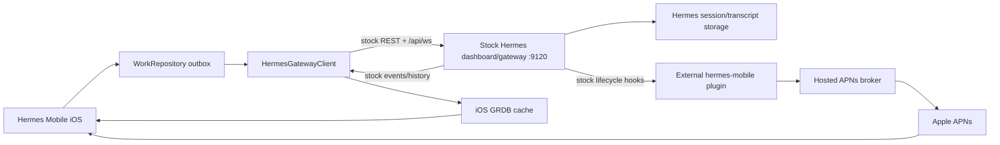

# Hermes Mobile current-state handover — 2026-07-28

This is the current handover for Hermes Mobile. It supersedes older notes where
they describe a relay-based interactive chat path, an unreleased PR, a
pre-build-139 app, or custom seams installed in the live production gateway.

## Audit boundary

The facts below were rechecked on 2026-07-28 against:

- GitHub repository `abhibansal-sg/hermes-mobile`;
- product baseline `edae3237f200dac90897ebb3d553124dd5a43418`;
- TestFlight build 139;
- the running Mac services and production source checkout;
- the installed `~/.hermes/plugins/hermes-mobile` package.

Historical tests and old handoffs are identified as historical evidence, not
silently promoted to current production proof.

## Executive status

### Done

- iOS interactive chat connects directly to the stock Hermes gateway REST and
  WebSocket surfaces. The co-located chat relay is not in the live data path.
- Desktop-style remote authentication is implemented: public auth probe,
  gateway-owned sign-in, persistent session cookies, and one-use WebSocket
  tickets.
- Session browsing is passive. iOS acquires a runtime only for an explicit
  drive action such as send, retry, stop, edit, or branch.
- Production sends use one durable `WorkRepository`/outbox path.
- Transcript loading is bounded, turn-safe, cache-first, and reconciled at
  authoritative turn boundaries.
- Stored session model/provider and stock live-running state are projected into
  the iOS UI.
- Forget Gateway unregisters the APNs token before local gateway credentials
  are erased.
- GitHub has zero open pull requests at this audit boundary.
- TestFlight build 139 is uploaded, processed, and `VALID`.

### Not done

- Build 139 still has a newly observed turn-presentation/retry defect: one
  logical live turn can show two `Working…` rows, and an interrupted prompt was
  observed twice in the transcript.
- The exact second-message trigger is not yet proven. The audit still needs to
  distinguish an automatic outbox retry from an explicit user Retry/Resend.
- The live stock gateway has no durable `client_message_id` receipt seam. An
  ambiguous retry therefore has no server-side idempotency guarantee.
- Current build-139 notification, clarification recovery, and remote Live
  Activity behavior have not been re-proved as one complete physical-device
  acceptance run.
- Repository-wide Swift CodeQL remains red on main because its generic build
  path does not configure the iOS/GRDB targets correctly. Required CI is green.
- The production stock checkout is clean but 595 commits behind its configured
  upstream `main`; no production update/restart was performed during this
  documentation audit.

## Current deployed topology



There are two historically overloaded uses of “relay”:

1. `relay/hermes_relay` is the old/co-located chat proxy. It is not listening
   on the live machine and iOS no longer needs it for interactive chat.
2. The hosted push broker is still a notification delivery edge. It carries
   APNs delivery metadata/events, not interactive chat sessions or transcripts.

No process was listening on the former chat-relay port `8788` during this
audit.

## Live Mac service truth

| Port | Current process | Meaning |
|---|---|---|
| `9120` | `/Volumes/MainData/Runtime/Hermes/hermes-agent/... dashboard --host 0.0.0.0 --port 9120` | Production remote gateway used by Hermes Mobile |
| `9119` | `/Volumes/MainData/Runtime/HermesReleases/299e409f.../hermes dashboard --host 127.0.0.1 --port 9119` | Separate Desktop-managed local backend |
| `8788` | no listener | Retired chat relay is not running |

Read-only health checks returned:

- `http://127.0.0.1:9120/api/health` → HTTP 200;
- `http://127.0.0.1:9119/health` → HTTP 200.

Do not confuse the `9119` Desktop backend with the `9120` production remote
gateway, and do not confuse either with the separate Weave gateway.

## Production core and plugin truth

### Hermes core

The production source checkout is:

```text
/Volumes/MainData/Runtime/Hermes/hermes-agent
HEAD 6179da549638dacc5717450e168b33ef4add0a21
branch main
working tree clean
tracking NousResearch/hermes-agent main, behind by 595 commits at audit time
```

This is a clean stock checkout: there are no local Hermes Mobile core patches.
“Stock” here means unmodified; it does not mean “at the newest upstream
commit.”

### Installed external plugins

The installed plugins are:

- `hermes-mobile`;
- `weave_search`.

The Fetch plugin is absent.

The installed Hermes Mobile plugin matches the tracked plugin source on
`origin/main`, excluding repository-only tests and runtime artifacts
(`__pycache__`, `.pyc`, and the live receipt SQLite file).

### What the plugin can use on pristine stock

The live stock checkout has the standard lifecycle hooks used for push:

- `pre_llm_call` / `post_llm_call`;
- tool hooks;
- approval hooks;
- session-finalize hooks.

The following fork-side generic seam symbols are absent from the live stock
checkout:

- S5 rich device-token identity/socket/ownership registries;
- S11 `register_prompt_receipt_provider`;
- S13 pending approval/clarification snapshot and resolver surfaces.

The plugin feature-detects these surfaces and degrades without crashing.
Consequences:

| Capability | Live stock result |
|---|---|
| Desktop-style username/password or session-cookie chat auth | Available |
| Stock chat RPCs/events/history | Available |
| Stock lifecycle-hook notification intake | Available in principle; current build-139 end-to-end proof still pending |
| Rich revocable device-token WS lifecycle | Not provided by pristine stock |
| Durable gateway deduplication by `client_message_id` | Not provided by pristine stock |
| Killed-app pending clarification reconstruction through S13 | Not provided by pristine stock |

The iOS app must not assume that sending a stable client ID automatically
makes a pristine stock gateway idempotent.

## Current iOS ownership model

There are three owners, not one blended state:

| Owner | Responsibility |
|---|---|
| Stock gateway | Current sessions, runtime ownership, transcript and live event truth |
| iOS `CacheStore` | Reconstructible last-confirmed local projection for fast/offline paint |
| iOS `WorkRepository` | Undelivered user intent and retry state |

The normal send path is:


Opening an existing session is read-only. Sending is the drive transition.
`session.active_list`, runtime metadata, and the bounded resume/history
snapshot supply liveness and model truth.

## Work completed and merged

The current product baseline includes:

| PR | Result |
|---|---|
| #249 | Unregister APNs token when forgetting a gateway |
| #251 | Direct connection to stock gateway with Desktop-style authentication |
| #252 | One bounded stock transcript read; removed broad plugin-era prefetch and stale project publication |
| #255 | Expand transcript pages to a complete user-turn boundary and reconcile terminal/broadcast gaps |
| #257 | Passive browse/explicit drive, one outbox path, atomic draft model selection, device-shaped Work DB migration |
| #259 | Restore stored model/provider and stock live-running state; remove redundant full-width activity bar |
| #261 | Reconnect from stock session truth, compressed-chain canonical identity, scheduled durable retry |
| #262 | Release build 139 |

GitHub `main` at the product audit boundary:

```text
edae3237f200dac90897ebb3d553124dd5a43418
```

There were zero open pull requests.

## Verification already completed

- PR #251: 49 focused tests on physical iPhone 16 Pro Max; signed device build
  installed and launched; live `9120` stock auth/ticket behavior confirmed.
- PR #252: 46 focused tests on physical iPhone 16 Pro Max; Release build
  succeeded.
- PR #255: 80-test and 31-test focused physical slices passed; Release build
  succeeded.
- PR #259: focused model/cache/live-turn tests passed on physical iPhone Air;
  signed build installed and launched.
- PR #261: 55 tests passed on physical iPhone 16 Pro Max; the full GitHub iOS
  suite passed.
- Xcode Cloud run `f70e50c4-d386-4172-8879-7e7d1c9cf574` built exact main SHA
  `edae3237f...`; Archive and TestFlight Internal Testing actions succeeded.
- App Store Connect reports build 139 `VALID`.
- Required GitHub CI for main SHA `edae3237f...` succeeded.

These results prove the listed slices at their recorded source heads. They do
not override the defects subsequently observed by the owner in build 139.

## Newly observed build-139 defect

Owner screenshots on 2026-07-28 show:

1. the same live turn rendering two adjacent `Working…` rows with the same
   elapsed time;
2. `Operation interrupted.`;
3. the same user text appearing again below the interrupted turn;
4. a new live Stop state.

What is factual:

- Two user-visible live-work projections existed simultaneously.
- The repeated text was separated by an interrupted assistant turn.
- Existing per-bubble tests are insufficient to prove the transcript-level
  invariant “one gateway turn → one live assistant row → one Working surface.”
- The live stock gateway has no S11 receipt provider, so automatic retry after
  an ambiguous transport result is not server-deduplicated.

What is not yet proven:

- whether the second submission was automatic or followed an explicit
  Retry/Resend action;
- which exact event/reconcile edge created or retained the second live
  assistant row;
- whether the gateway transcript itself contains two submitted turns or the
  duplication is purely an iOS projection.

Do not patch from the screenshots alone. Capture the outbox row transitions,
gateway transcript, and device event sequence for that exact stored session.

## Pending work, in order

### P0 — Prove and fix the duplicate-turn projection

1. Reproduce on build 139 with device logging.
2. Record the stored session ID, runtime ID, outbox job ID,
   `client_message_id`, submit disposition, interrupt, reconnect, and retry
   transitions.
3. Compare the gateway transcript with `ChatStore.messages`.
4. Confirm whether Retry/Resend was explicitly tapped.
5. Correct the existing ownership/reconcile path. Do not add another transcript
   store, coordinator, replay layer, or identity map.

Required invariant:

```text
one accepted logical submission
→ at most one visible user row
→ at most one active assistant row
→ exactly one live Working affordance
→ one terminal result
```

### P0 — Resolve pristine-stock retry semantics

The product currently combines:

- an iOS durable retrying outbox;
- a pristine stock gateway with no durable submit receipt/dedup seam.

That combination cannot claim exactly-once submission after an ambiguous
transport failure. The next correction must choose and prove a stock-compatible
policy, such as reconciliation before retry or an explicit owner retry, without
silently reintroducing a core patch.

### P1 — Signed-build physical acceptance

After the narrow correction:

- new chat → send → one Working row → standalone reply;
- interrupt → no automatic duplicate;
- reconnect during a turn → one reconciled reply;
- switch away/back and force-close/reopen → same stored session paints;
- passive open of a Desktop/TUI-driven turn → Working/Stop without ownership
  theft;
- notification completion and approval navigation;
- clarification behavior on pristine stock;
- Live Activity start/update/end;
- offline queue drain without duplicate submission.

### P1 — Production/runtime hygiene

- Decide when to update the clean production stock checkout that is 595 commits
  behind upstream. Treat this as a separately approved production
  update/restart, not part of an iOS documentation merge.
- Re-prove the installed plugin is loaded and its stock-hook push path is
  healthy after that update.
- Keep `9120` production and `9119` Desktop backend operationally distinct.

### P2 — Repository hygiene

- Fix or disable the misconfigured Swift CodeQL default setup for the iOS/GRDB
  project; do not confuse it with the green required CI gate.
- Audit and remove stale relay-era prose. In particular, the plugin module
  docstring still says the phone talks through the transparent relay although
  PR #251 made interactive chat direct.
- Decide whether unused `relay/hermes_relay` source should remain as a supported
  optional component or be deleted. Runtime retirement is already complete;
  source deletion needs a separate dependency audit.
- Archive or annotate older handoffs rather than using them as current truth.

## Next-agent starting point

Start from current `origin/main` in a clean isolated worktree. Do not use or
clean the owner's detached dirty checkout.

First task: diagnose the build-139 duplicate Working/repeated-prompt episode
with one physical-device reproduction and one gateway transcript comparison.
Stop at the exact failing transition before changing code.

Useful read-only checks:

```sh
git fetch origin --prune
git rev-parse origin/main
gh pr list --repo abhibansal-sg/hermes-mobile --state open
lsof -nP -iTCP -sTCP:LISTEN | rg ':(9120|9119|8788)'
git -C /Volumes/MainData/Runtime/Hermes/hermes-agent status -sb
```

Physical iOS builds/tests must use:

```sh
scripts/ios-build.sh
```

Do not start Simulator on the owner's Mac Studio, do not restart production as
part of diagnosis, and do not reintroduce the interactive chat relay.
